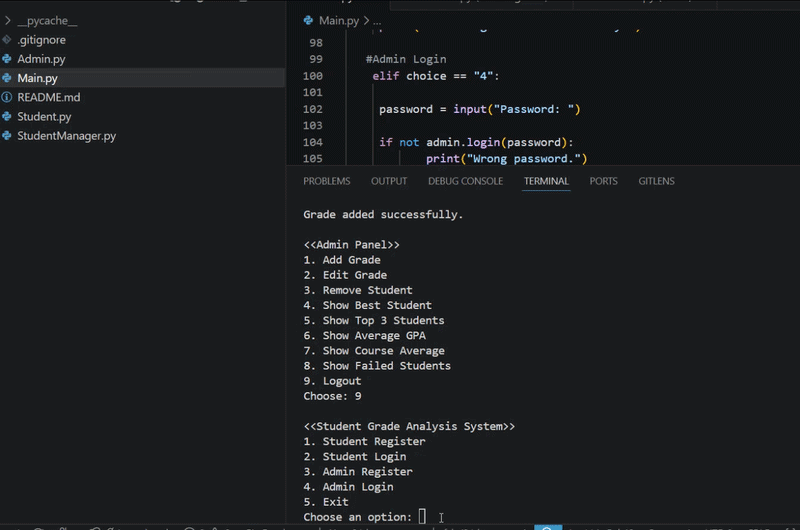

# سیستم مدیریت و تحلیل نمرات دانشجویان



## معرفی پروژه

این پروژه با زبان برنامه‌نویسی پایتون و با استفاده از برنامه‌نویسی شیءگرا (OOP) طراحی شده است.

هدف پروژه، مدیریت اطلاعات دانشجویان و تحلیل نمرات آن‌ها است.


## امکانات پروژه

- ثبت دانشجو
- ورود دانشجو
- ثبت و ورود ادمین
- افزودن نمره
- ویرایش نمرات
- محاسبه معدل دانشجو
- تعیین سطح دانشجو (عالی، متوسط، ضعیف)
- محاسبه میانگین معدل کل دانشجویان
- محاسبه میانگین نمرات هر درس
- نمایش بهترین دانشجو
- نمایش سه دانشجوی برتر
- نمایش دانشجویان ضعیف
- حذف دانشجو
- رسم نمودار نمرات با استفاده از Matplotlib

## ساختار پروژه

- Student.py
- StudentManager.py
- Admin.py
- main.py

## فناوری‌های استفاده شده

- Python
- Matplotlib
- Object-Oriented Programming (OOP)

## نحوه اجرای پروژه

ابتدا کتابخانه مورد نیاز را نصب کنید:

```bash
pip install matplotlib
```

سپس فایل اصلی را اجرا کنید:

```bash
python main.py
```


# Student Grade Management and Analysis System

## Project Introduction

This project is designed using the Python programming language and Object-Oriented Programming (OOP) principles.

The goal of this project is to manage student information and analyze their grades.

## Project Features

- Student registration
- Student login
- Admin registration and login
- Adding grades
- Editing grades
- Calculating student GPA
- Student level classification (Excellent, Average, Weak)
- Calculating the overall average GPA of students
- Calculating the average grade for each course
- Displaying the best student
- Displaying the top three students
- Displaying weak students
- Deleting students
- Plotting grade charts using Matplotlib

## Project Structure

- Student.py
- StudentManager.py
- Admin.py
- main.py

## Technologies Used

- Python
- Matplotlib
- Object-Oriented Programming (OOP)

## How to Run the Project

First, install the required library:

```bash
pip install matplotlib
```

then run the main file : 

```bash
python main.py
```